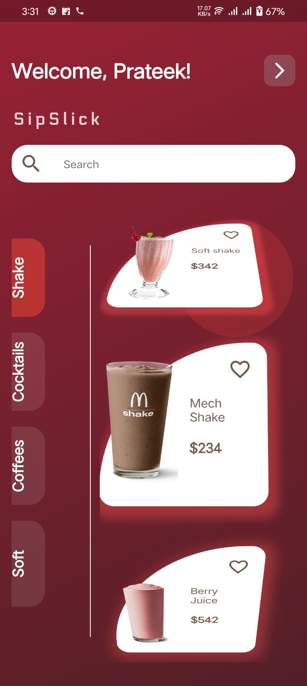

# SipSlick App 🍹☕️🥤

Welcome to SipSlick, a unique Flutter-based app designed for beverage enthusiasts! Whether you're a coffee lover, a cocktail aficionado, or a smoothie fan, SipSlick has something for everyone.

## 🌟 Features

- **User Profiles**: Create your own profile and keep track of your favorite drinks.
- **Search Functionality**: Find drinks based on ingredients, names, or categories.
- **Personalized Recommendations**: Get drink suggestions based on your preferences.
- **Community Reviews**: Read reviews from other users and share your own experiences.
- **Interactive UI**: A user-friendly interface that's easy to navigate.




## 🚀 Getting Started

### Prerequisites

- Flutter SDK
- Dart

### Installation

1. Clone the repository:
   ```bash
   git clone https://github.com/prateekp273/SipSlick.git


