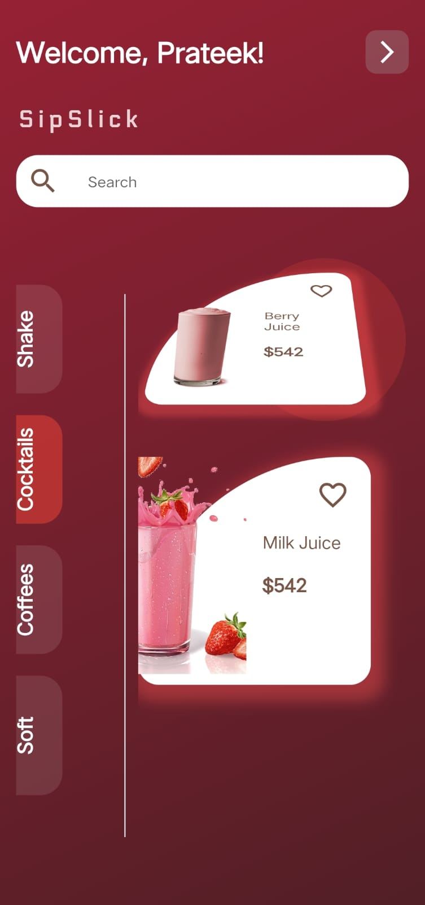

# SipSlick App 🍹☕️🥤

Welcome to SipSlick, a unique Flutter-based app designed for beverage enthusiasts! Whether you're a coffee lover, a cocktail aficionado, or a smoothie fan, SipSlick has something for everyone.

## 🌟 Features

- **User Profiles**: Create your own profile and keep track of your favorite drinks.
- **Search Functionality**: Find drinks based on ingredients, names, or categories.
- **Personalized Recommendations**: Get drink suggestions based on your preferences.
- **Community Reviews**: Read reviews from other users and share your own experiences.
- **Interactive UI**: A user-friendly interface that's easy to navigate.

<p float="left">
  
  
</p>
<p float="left">
  
  
</p>

## 🚀 Getting Started

### Prerequisites

- Flutter SDK
- Dart

### Installation

1. Clone the repository:
   ```bash
   git clone https://github.com/prateekp273/SipSlick.git

1. Navigate to the project directory and install dependencies:
   ```bash
     cd SipSlick
     flutter pub get

2. Run the app:
   ```bash
     flutter run

🛠 Built With
- Flutter - UI toolkit for building natively compiled applications.
- Dart - Language optimized for building mobile, desktop, and web apps.

.
🤝 Contribute to SipSlick
We cherish every contribution & support. If you'd like to be a part of the SipSlick journey:

- Fork the repository.
- Create a new branch for features or fixes.
- Send us a pull request.
- Ensure your code is neat and commented.


📜 License
This project is licensed under the MIT License. See the LICENSE file for details.

🙌 Acknowledgments
- Flutter Documentation
- Dart Packages
- Cheers to all the ☕ coffee lovers who inspired this project!

📞 Get in Touch
For queries, suggestions, or feedback, drop us a line:

- 📧 Email: prateekp18012000@gmail.com
- 🐦 Twitter: @Prateekpatel273


